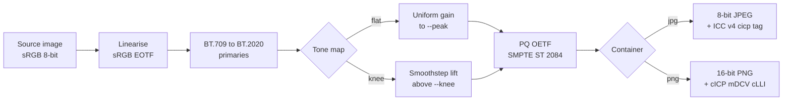

# png2hdr

Make an image glow on HDR displays :: and pick the container that actually survives
the upload.

---

## The brief

This started as a client question :: how do we make our logo pop on LinkedIn? Not
larger, not louder. Actually brighter than the white of the page around it, the way a
good HDR photo glows in a feed while everything beside it sits flat.

It took a couple of passes. The colour maths landed quickly. What ate the time was
watching a correct file arrive on the platform looking like nothing had happened,
because the part that carries the glow kept getting stripped in transit. png2hdr is
where those passes settled :: the recommendation, the exact commands to reproduce it,
and, further down, why any of it works.

---

## Why png2hdr

HDR is not a pixel trick. There is no arrangement of samples that goes brighter than
SDR white on its own. Something has to *tell* the compositor to allocate headroom, and
every mechanism that does this (`cICP`, ICC profiles, gain maps) is ancillary data.
Ancillary data is the first thing an upload pipeline throws away.

So you can do the colour science perfectly and still ship a file that renders as mud,
because the one chunk carrying the signal got dropped somewhere between your machine
and a CDN.

png2hdr does the conversion correctly, writes it into the container most likely to
survive, and gives you a way to check what actually arrived.

---

## Run it

Fastest, with [uv](https://docs.astral.sh/uv/) or [pipx](https://pipx.pypa.io) ::

```bash
uv tool install git+https://github.com/danoszz/png2hdr
# or: pipx install git+https://github.com/danoszz/png2hdr
png2hdr --version
```

No uv or pipx? A plain virtualenv works with the Python that ships with macOS ::

```bash
git clone https://github.com/danoszz/png2hdr && cd png2hdr
python3 -m venv ~/.venvs/png2hdr
~/.venvs/png2hdr/bin/pip install -q --upgrade pip
~/.venvs/png2hdr/bin/pip install -q .
ln -sf ~/.venvs/png2hdr/bin/png2hdr ~/.local/bin/png2hdr   # anywhere on your PATH
png2hdr --version
```

Python 3.9+, numpy, Pillow. No native build, no libpng, no ImageMagick.

> On macOS, do not `pip install` against the system interpreter. PEP 668 blocks it, and
> forcing past it drops numpy and Pillow into the OS Python.

---

## What it does

| Mode | Command | What happens |
| --- | --- | --- |
| **flat** | `--mode flat` *(default)* | Uniform gain in linear light until the brightest channel hits `--peak`. For logos, marks, flat colour fields. |
| **knee** | `--mode knee` | Smoothstep lift above `--knee` linear luma, hue preserving. For photographs and specular highlights. |
| **retag** | `--mode retag` | Adds `cICP` without touching pixels. Pure `#000`/`#fff` artwork only. |
| **inspect** | `--inspect` | Reports what HDR signalling a file or URL actually carries. |

Containers:

| Flag | Output | Reach |
| --- | --- | --- |
| `--format jpg` *(default)* | 8-bit PQ + ICC v4 profile with a `cicp` tag | Survives most upload pipelines |
| `--format png` | 16-bit PQ + `cICP`, `mDCV`, `cLLI` | Correct and higher fidelity. Usually stripped on upload. |

```bash
# the one you want for anything you upload
png2hdr logo.png -o logo_hdr.jpg --peak 1000

# see the luminance report before committing
png2hdr logo.png --dry-run --peak 1600

# purist path :: 16-bit PNG, full chunk set
png2hdr photo.png -o photo_hdr.png --format png --mode knee

# what did the CDN actually serve back?
png2hdr https://cdn.example.com/served.jpg --inspect
```

---

## How it works



`retag` skips the middle entirely and only writes the label.

---

## First principles

A walk through the whole idea, assuming you have never met any of these terms. Every
step maps to one arrow in the diagram above.

**A screen's white is not its brightest.** Show a blank white page and the panel is
loafing, holding power in reserve. A standard image cannot reach that reserve, because
its brightest possible pixel, `#ffffff`, is *defined* as white. There is no number
above white. That is what SDR (standard dynamic range) means :: the code and the
paper-white of the display are pinned together.

**HDR is permission, not paint.** An HDR display can drive small regions far past paper
white, often ten times past. Nothing in the pixels alone unlocks that. The file has to
carry a note to the compositor that says "read these values on an absolute brightness
scale, and give them the headroom they ask for." Make the note convincing and a flat
logo lifts off the page. That note is the whole game.

**Colour is coordinates, and the axes can move.** A triple `(R, G, B)` means nothing
until you say *which* red, green, and blue. sRGB, the web default, uses one set of
primaries; Rec.2020, the wide gamut HDR rides on, uses far more saturated ones. Before
any of that you undo the display gamma to reach *linear light*, where values are
proportional to photons and safe to scale. The sRGB decode is piecewise:

```math
C_\text{lin} =
\begin{cases}
C / 12.92, & C \le 0.04045 \\
\left(\dfrac{C + 0.055}{1.055}\right)^{2.4}, & C > 0.04045
\end{cases}
```

Then rotate the coordinates from BT.709 (sRGB's primaries) into BT.2020 with a fixed
3x3 matrix:

```math
\begin{bmatrix} R \\ G \\ B \end{bmatrix}_{2020}
=
\begin{bmatrix}
0.6274 & 0.3293 & 0.0433 \\
0.0691 & 0.9195 & 0.0114 \\
0.0164 & 0.0880 & 0.8956
\end{bmatrix}
\begin{bmatrix} R \\ G \\ B \end{bmatrix}_{709}
```

**Now attach real brightness.** Linear light is still relative :: `1.0` only means "as
bright as the source could go." png2hdr scales it onto an absolute axis measured in
cd/m^2 (nits). In `flat` mode every pixel takes one shared gain, chosen so the
brightest channel lands exactly on `--peak`:

```math
Y = w \, g \, C_\text{lin}, \qquad g = \frac{\text{peak}}{w \cdot \max_i C_{\text{lin},\,i}}
```

`w` is diffuse white, 203 cd/m^2 by ITU-R BT.2408. `knee` mode leaves the midtones alone
and lifts only the highlights with a smoothstep, which is what photographs want. Either
way the luminance in the report is the BT.2020 weighted sum
`Y = 0.2627 R + 0.6780 G + 0.0593 B`.

**PQ is an absolute ruler.** To store those nits png2hdr applies the Perceptual
Quantizer (SMPTE ST 2084), the transfer function almost every HDR format speaks. Unlike
gamma it is absolute :: a given code always means a given luminance, from 0 to 10000
cd/m^2, spaced to match how the eye notices steps.

```math
V = \left( \frac{c_1 + c_2\,Y_n^{\,m_1}}{1 + c_3\,Y_n^{\,m_1}} \right)^{m_2},
\qquad Y_n = \frac{Y}{10000}
```

```math
m_1 = \tfrac{2610}{16384},\quad
m_2 = \tfrac{2523}{4096}\cdot 128,\quad
c_2 = \tfrac{2413}{4096}\cdot 32,\quad
c_3 = \tfrac{2392}{4096}\cdot 32,\quad
c_1 = c_3 - c_2 + 1
```

That is `m1 = 0.15930`, `m2 = 78.844`, `c1 = 0.8359`, `c2 = 18.852`, `c3 = 18.688`, and
it puts 100 nits at signal `0.508`, 1000 at `0.752`, and 10000 at `1.0`. `--dry-run`
prints the numbers behind those curves before you write anything.

**The signal is metadata, and metadata is disposable.** The pixels are PQ now, which is
meaningless until something tags them "BT.2020, PQ, full range." That tag is the four
code points `9 / 16 / 0 / 1`, and it can ride three ways :: a PNG `cICP` chunk, an ICC
profile, or a gain map. Here is the hack. Upload pipelines re-encode your image and drop
any ancillary block they do not recognise. `cICP` is new, so it gets stripped. ICC
profiles are decades old and load-bearing for colour management, so pipelines carry them
through untouched. So png2hdr puts 8-bit PQ pixels in a **JPEG** and smuggles the
`9/16/0/1` signal inside the ICC profile's `cicp` tag. Ugly on paper, correct in
practice, because it is the version that survives the trip.

**Why a neutral mark on a dark field.** If the tag is stripped anyway, the PQ pixels get
read as ordinary sRGB. A neutral bright mark degrades to a legible light grey; a
saturated field degrades to mud. Keep the bright area small and its frame-average
brightness (MaxFALL) low, and the display grants the headroom without a fight. That is
why the trick flatters a logo far more than a photo, and why `--inspect` exists :: point
it at the URL the platform hands back and see which of the three fates your file met.

---

## Choosing a peak

The number that predicts success is **not** peak brightness. It is MaxFALL, the
frame-average light level. Displays grant peak output for small windows, not full
fields, so a bright mark on a dark background can run the full display peak while a
near-white field is already over budget before you pick anything.

| Asset shape | Coverage | Peak | MaxFALL |
| --- | --- | --- | --- |
| White mark on black | 15% | 1600 | 238 |
| Saturated field, black mark | 94% | 600 | 462 |
| Saturated field, black mark | 94% | 1000 | 771 |

`--dry-run` prints MaxFALL before you write anything, and warns past ~500.

> **On that threshold.** One asset, one platform, two uploads. 600 glowed and 1000 did
> not. That is n=1, not a validated limit :: the real line sits somewhere between them,
> may well be higher, and probably moves with ambient light, the brightness slider, and
> whatever the platform did to your file that day. Treat the warning as a nudge to run
> `--dry-run`, not as physics.

The technique flatters one shape above all others: **a small neutral mark on a dark
field.** Neutral matters because if the profile does get stripped, PQ samples get read
as sRGB, and a white mark degrades to legible light grey while a saturated field
degrades to mud.

---

## Verify

```bash
png2hdr out.jpg --inspect
```

```
  container      JPEG
  APP2             2,620  ICC_PROFILE
  encoding       progressive
  ICC            2,604 bytes, cicp tag -> [9, 16, 0, 1] :: BT.2020 / PQ (ST 2084) / matrix 0 / full range

  VERDICT  HDR signalled :: PQ (ST 2084). Should drive display headroom.
```

Point it at the URL a platform serves back to you. That is the only measurement worth
trusting, and it takes about ten seconds.

---

## ICC profiles

For JPEG output the profile is resolved in this order:

1. `--icc /path/to/profile.icc`
2. A system Rec.2020 PQ profile, if one is installed
3. A generated ICC v4.4 profile (~2.6 KB), built from BT.2020 primaries, a sampled PQ
   tone curve, and a `cicp` tag of `9 / 16 / 0 / 1`

The `cicp` tag is what HDR-aware colour engines read. The matrix and TRC tags exist so
that engines which do not understand `cicp` fall back to something sane instead of
nonsense.

`--neutral-blue` helps saturated sources whose blue channel is genuinely zero. The
BT.709 to BT.2020 primaries change invents a small blue term, and because PQ is steep
near black that term encodes to a large code value and wrecks the fallback. Zeroing it
costs nothing in HDR and keeps the fallback on-hue.

---

## Limits

- 8-bit JPEG output bands on gradients. Flat colour and hard-edged artwork are fine;
  skies are not. Use `--format png` when fidelity beats reach.
- Display headroom is not constant. macOS allocates it from ambient light and the
  brightness slider. In a bright room at full SDR brightness it can collapse toward
  1.0x and the effect disappears.
- Platform behaviour is observed, not guaranteed. Re-run `--inspect` rather than
  trusting anything written here.
- `retag` refuses non-pure images by default. PQ and sRGB agree at neither endpoint's
  neighbours, so relabelling a mid-tone rotates its hue hard. `#CEF900` retagged decodes
  to 1671 / 7994 / 0 cd/m², collapsing chartreuse into pure green. `--force` if you
  mean it.
- `mDCV` primary ordering follows PNG Third Edition (R, G, B), not the G, B, R inherited
  from HEVC SEI. Verify with `pngcheck -v` if it matters.

---

## Tests

```bash
~/.venvs/png2hdr/bin/pip install -q '.[test]'
~/.venvs/png2hdr/bin/pytest
```

The suite pins the PQ transfer to its ST 2084 anchors (100 cd/m² -> 0.5081, 1000 ->
0.7518), parses the generated profile under `ImageCms` and reads its `9 / 16 / 0 / 1`
cicp tag, confirms the ICC survives a JPEG save and load, checks the PNG chunk order
(`IHDR`, `cICP`, `mDCV`, `cLLI`, ..., `IDAT`, `IEND`), exercises the `retag` guard, and
verifies flat mode leaves linear-light channel ratios untouched. CI runs it on Python
3.9 through 3.13.

---

## Status

**v0.2.2, early.** Conversion, both containers, the generated ICC profile, and the
inspector all work and are tested. The platform-survival claims rest on a small number
of real uploads and should be re-measured rather than believed.

Issues and PRs welcome.

---

## Prior art

- [W3C PNG Third Edition](https://w3c.github.io/png/) :: `cICP`, `mDCV`, `cLLI`
- [Chris Lilley, cICP in PNG explained](https://svgees.us/blog/cICP.html)
- [Greg Benz on HDR file formats](https://gregbenzphotography.com/other/which-file-formats-to-use-for-photography/)
- ITU-R BT.2100 and BT.2408 :: the PQ system and reference diffuse white
- SMPTE ST 2084 :: the PQ transfer function

---

## License

MIT. See [LICENSE](LICENSE).
