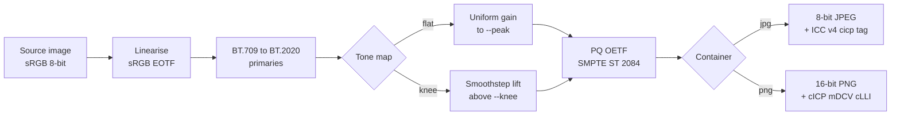

# png2hdr

Make an image glow on HDR displays :: and pick the container that actually survives
the upload.

---

## Why png2hdr

HDR is not a pixel trick. There is no arrangement of samples that goes brighter than
SDR white on its own. Something has to *tell* the compositor to allocate headroom, and
every mechanism that does this (`cICP`, ICC profiles, gain maps) is ancillary data.
Ancillary data is the first thing an upload pipeline throws away.

So you can do the colour science perfectly and still ship a file that renders as mud,
because the one chunk carrying the signal got dropped somewhere between your machine
and a CDN.

png2hdr does the conversion correctly, writes it into the container most likely to
survive, and gives you a way to check what actually arrived.

---

## Run it

```bash
git clone https://github.com/danoszz/png2hdr && cd png2hdr
python3 -m venv ~/.venvs/png2hdr
~/.venvs/png2hdr/bin/pip install -q --upgrade pip
~/.venvs/png2hdr/bin/pip install -q .
ln -sf ~/.venvs/png2hdr/bin/png2hdr ~/bin/png2hdr   # anywhere on your PATH
png2hdr --version
```

Already have pipx or uv?

```bash
pipx install git+https://github.com/danoszz/png2hdr
uv tool install git+https://github.com/danoszz/png2hdr
```

Python 3.9+, numpy, Pillow. No native build, no libpng, no ImageMagick. Works with
the Python that ships with macOS.

> On macOS, do not `pip install` against the system interpreter. PEP 668 blocks it, and
> forcing past it drops numpy and Pillow into the OS Python.

---

## What it does

| Mode | Command | What happens |
| --- | --- | --- |
| **flat** | `--mode flat` *(default)* | Uniform gain in linear light until the brightest channel hits `--peak`. For logos, marks, flat colour fields. |
| **knee** | `--mode knee` | Smoothstep lift above `--knee` linear luma, hue preserving. For photographs and specular highlights. |
| **retag** | `--mode retag` | Adds `cICP` without touching pixels. Pure `#000`/`#fff` artwork only. |
| **inspect** | `--inspect` | Reports what HDR signalling a file or URL actually carries. |

Containers:

| Flag | Output | Reach |
| --- | --- | --- |
| `--format jpg` *(default)* | 8-bit PQ + ICC v4 profile with a `cicp` tag | Survives most upload pipelines |
| `--format png` | 16-bit PQ + `cICP`, `mDCV`, `cLLI` | Correct and higher fidelity. Usually stripped on upload. |

```bash
# the one you want for anything you upload
png2hdr logo.png -o logo_hdr.jpg --peak 1000

# see the luminance report before committing
png2hdr logo.png --dry-run --peak 1600

# purist path :: 16-bit PNG, full chunk set
png2hdr photo.png -o photo_hdr.png --format png --mode knee

# what did the CDN actually serve back?
png2hdr https://cdn.example.com/served.jpg --inspect
```

---

## How it works



`retag` skips the middle entirely and only writes the label.

---

## Choosing a peak

The number that predicts success is **not** peak brightness. It is MaxFALL, the
frame-average light level. Displays grant peak output for small windows, not full
fields, so a bright mark on a dark background can run the full display peak while a
near-white field is already over budget before you pick anything.

| Asset shape | Coverage | Peak | MaxFALL |
| --- | --- | --- | --- |
| White mark on black | 15% | 1600 | 238 |
| Saturated field, black mark | 94% | 600 | 462 |
| Saturated field, black mark | 94% | 1000 | 771 |

`--dry-run` prints MaxFALL before you write anything, and warns past ~500.

> **On that threshold.** One asset, one platform, two uploads. 600 glowed and 1000 did
> not. That is n=1, not a validated limit :: the real line sits somewhere between them,
> may well be higher, and probably moves with ambient light, the brightness slider, and
> whatever the platform did to your file that day. Treat the warning as a nudge to run
> `--dry-run`, not as physics.

The technique flatters one shape above all others: **a small neutral mark on a dark
field.** Neutral matters because if the profile does get stripped, PQ samples get read
as sRGB, and a white mark degrades to legible light grey while a saturated field
degrades to mud.

---

## Verify

```bash
png2hdr out.jpg --inspect
```

```
  container      JPEG
  APP2             2,620  ICC_PROFILE
  encoding       progressive
  ICC            2,604 bytes, cicp tag -> [9, 16, 0, 1] :: BT.2020 / PQ (ST 2084) / matrix 0 / full range

  VERDICT  HDR signalled :: PQ (ST 2084). Should drive display headroom.
```

Point it at the URL a platform serves back to you. That is the only measurement worth
trusting, and it takes about ten seconds.

---

## ICC profiles

For JPEG output the profile is resolved in this order:

1. `--icc /path/to/profile.icc`
2. A system Rec.2020 PQ profile, if one is installed
3. A generated ICC v4.4 profile (~2.6 KB), built from BT.2020 primaries, a sampled PQ
   tone curve, and a `cicp` tag of `9 / 16 / 0 / 1`

The `cicp` tag is what HDR-aware colour engines read. The matrix and TRC tags exist so
that engines which do not understand `cicp` fall back to something sane instead of
nonsense.

`--neutral-blue` helps saturated sources whose blue channel is genuinely zero. The
BT.709 to BT.2020 primaries change invents a small blue term, and because PQ is steep
near black that term encodes to a large code value and wrecks the fallback. Zeroing it
costs nothing in HDR and keeps the fallback on-hue.

---

## Limits

- 8-bit JPEG output bands on gradients. Flat colour and hard-edged artwork are fine;
  skies are not. Use `--format png` when fidelity beats reach.
- Display headroom is not constant. macOS allocates it from ambient light and the
  brightness slider. In a bright room at full SDR brightness it can collapse toward
  1.0x and the effect disappears.
- Platform behaviour is observed, not guaranteed. Re-run `--inspect` rather than
  trusting anything written here.
- `retag` refuses non-pure images by default. PQ and sRGB agree at neither endpoint's
  neighbours, so relabelling a mid-tone rotates its hue hard. `#CEF900` retagged decodes
  to 1671 / 7994 / 0 cd/m², collapsing chartreuse into pure green. `--force` if you
  mean it.
- `mDCV` primary ordering follows PNG Third Edition (R, G, B), not the G, B, R inherited
  from HEVC SEI. Verify with `pngcheck -v` if it matters.

---

## Tests

```bash
~/.venvs/png2hdr/bin/pip install -q '.[test]'
~/.venvs/png2hdr/bin/pytest
```

The suite pins the PQ transfer to its ST 2084 anchors (100 cd/m² -> 0.5081, 1000 ->
0.7518), parses the generated profile under `ImageCms` and reads its `9 / 16 / 0 / 1`
cicp tag, confirms the ICC survives a JPEG save and load, checks the PNG chunk order
(`IHDR`, `cICP`, `mDCV`, `cLLI`, ..., `IDAT`, `IEND`), exercises the `retag` guard, and
verifies flat mode leaves linear-light channel ratios untouched. CI runs it on Python
3.9 through 3.13.

---

## Status

**v0.2.2, early.** Conversion, both containers, the generated ICC profile, and the
inspector all work and are tested. The platform-survival claims rest on a small number
of real uploads and should be re-measured rather than believed.

Issues and PRs welcome.

---

## Prior art

- [W3C PNG Third Edition](https://w3c.github.io/png/) :: `cICP`, `mDCV`, `cLLI`
- [Chris Lilley, cICP in PNG explained](https://svgees.us/blog/cICP.html)
- [Greg Benz on HDR file formats](https://gregbenzphotography.com/other/which-file-formats-to-use-for-photography/)
- ITU-R BT.2100 and BT.2408 :: the PQ system and reference diffuse white
- SMPTE ST 2084 :: the PQ transfer function

---

## License

MIT. See [LICENSE](LICENSE).
